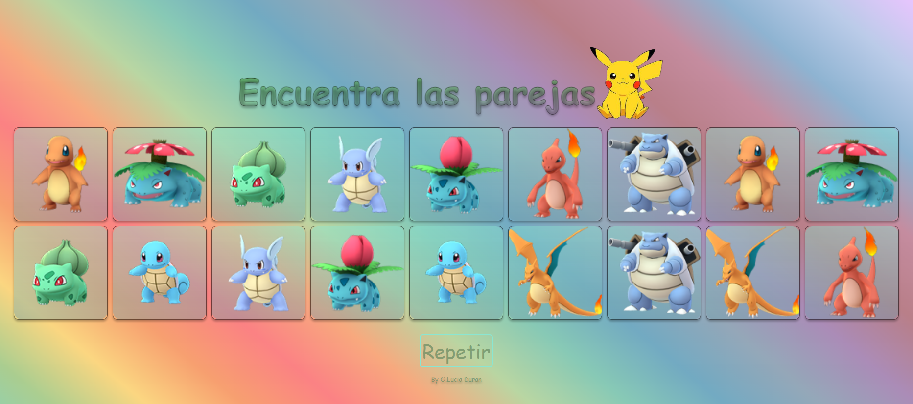

# Memory Match Game

## Índice

* [1. Preámbulo](#1-preámbulo)
* [2. Resumen del proyecto](#2-resumen-del-proyecto)
* [3. Consideraciones técnicas](#3-consideraciones-tecnicas)
* [4. Prototipos](#4-prototipos)
* [5. Diseño final para los usuarios](#5-diseño-final-para-los-usuarios)

***

## 1. Preámbulo

El juego Memory Match, también conocido como Concentration, es un clásico juego de cartas que desafía la memoria de los jugadores al emparejar cartas similares. En este proyecto, implementaremos una versión web de Memory Match, permitiendo a los usuarios disfrutar del juego en sus navegadores.

## 2. Resumen del proyecto

El proyecto consiste en desarrollar una versión web del juego Memory Match, donde los usuarios puedan jugar y mejorar su memoria. El objetivo principal es proporcionar una interfaz interactiva y atractiva que permita a los jugadores disfrutar de una experiencia de juego divertida y desafiante.

### Objetivos generales:

* Construcción de una interfaz intuitiva y atractiva.
* Implementación de la lógica del juego utilizando JavaScript.
* Asegurar que el juego sea compatible y se vea bien en diferentes * dispositivos y tamaños de pantalla.
* Aplicar principios de diseño visual para mejorar la experiencia del usuario.

### Resultados:

El proyecto finalizado ofrecerá una experiencia de juego envolvente y agradable para los usuarios, permitiéndoles disfrutar del clásico juego de Memory Match directamente desde sus navegadores web.

## 3. Consideraciones técnicas

La implementación del proyecto se basa en tecnologías web estándar, incluyendo HTML, CSS y JavaScript. La lógica del juego estará escrita en JavaScript, mientras que CSS se utilizará para estilizar la interfaz y HTML para la estructura de la página.

### Resultados:

El proyecto finalizado ofrecerá una experiencia de juego envolvente y agradable para los usuarios, permitiéndoles disfrutar del clásico juego de Memory Match directamente desde sus navegadores web.

### Estructura de archivos

```text
.
├── .babelrc
├── .editorconfig
├── .eslintrc
├── .gitignore
├── package.json
├── README.md
└── src
    ├── components
    │   ├── App.js
    │   └── App.spec.js
    ├── data
    │   ├── pokemon
    │   │   ├── pokemon.js
    │   │   └── pokemon.json
    │   ├── README.md
    │   └── webdev
    │       ├── webdev.js
    │       └── webdev.json
    ├── index.html
    ├── main.js
    └── style.css
```

## 4. Prototipos

Durante el desarrollo del proyecto, se crearon varios prototipos y diseños preliminares para definir la apariencia y la experiencia de usuario del juego.

### Diseño Figma


### Diseño en Curso


## 5. Diseño final para los usuarios




### Diseño Movil

